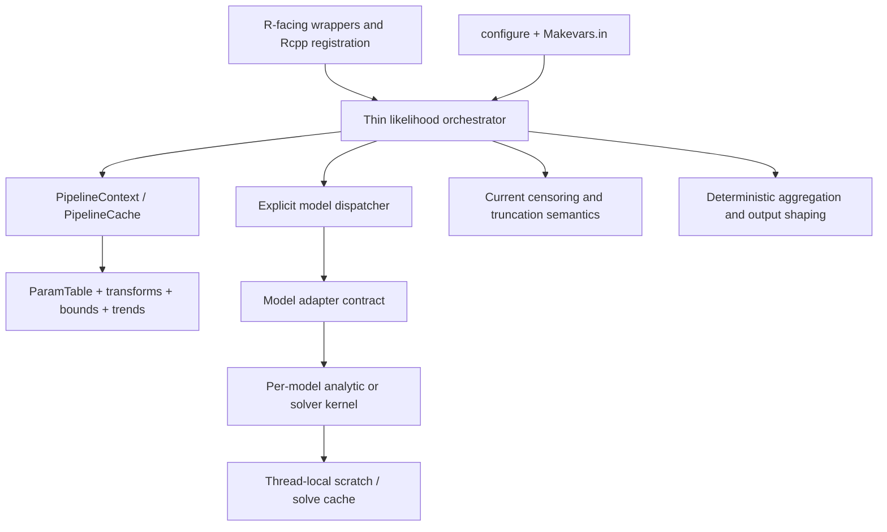

# Behavior-Preserving C++ Architecture Refactor Plan

## 1. Objective

Refactor the current EMC2 C++ implementation so that its build and source architecture are closer to `/data/work/EMC2_cens_trunc2/`, while preserving the current package's complete behavior.

The refactor is intended to:

- split the monolithic C++ orchestration and header-heavy model implementation into independently compilable translation units;
- reduce rebuild scope and package build time;
- make model, likelihood, solver, parameter-mapping, and Rcpp-boundary responsibilities explicit;
- preserve useful optimization (contiguous buffers, precomputed mappings, cached numerical solves, inlining of genuinely hot scalar cores);
- introduce a controlled OpenMP strategy, including evaluation of `#pragma omp simd` versus `#pragma omp parallel for`/parallel regions;
- reduce reliance on forced `-O3 -march=native -ffast-math` flags where measured performance and numerical equivalence permit it.

This is a **code-structure and build refactor only**. It must not change the numerical behavior of likelihood functions, public R-facing behavior, supported data conventions, model inventory, solver inventory, or random-generation semantics.

## 2. Non-negotiable scope constraints

### Must remain unchanged

1. **All current models and variants remain supported.** This includes, at minimum, the analytic race families, BAwL/BAwD/BAwF/BAwDp variants, FRQ, RDM/GBM/RDMSWTN/timed and correlated variants, LNR/REXG/PCOUNTER, RLF, GOM, ROU, BOU, DDM, MRI/fMRI, stop-signal models, softmax/ordered paths, Volterra diffusion models, contaminant/guess/timer/capacity variants, and current solver-backed architectures.
2. **All current solver implementations remain available.** Do not replace or remove FPE, Volterra, RLF, quadrature, GSL/hcubature, Gaussian/BVN, or related numerical paths merely because the reference package organizes them differently.
3. The existing R-facing interfaces and generated registration must remain compatible, including `calc_ll_oo`, `calc_ll_oo_pw`, marginal-likelihood entry points, parameter wrappers, model RNG entry points, counters, probes, and other current `[[Rcpp::export]]` functions.
4. Current parameter names, parameter ordering, column registries, model-name suffix dispatch, bounds, transforms, censoring/truncation fields, trial expansion/compression, and data attributes remain compatible.
5. Current likelihood numerical output is preserved. This includes finite, censored, truncated, missing/`NA`, `-Inf`, `+Inf`, defective-tail, guess, contaminant, timer, logical-rules, correlated, PDE, Volterra, and marginalization paths.
6. The current package's data conventions remain authoritative.
- The current RT encoding is part of the contract: preserve the meaning of `rt = -Inf` (lower censoring), `rt = +Inf` (omission/upper-censoring behavior as currently interpreted), `rt = NA` (undirected missing response), and the existing `LT`, `UT`, `LC`, and `UC` columns. Any extracted censor/truncation module must encode these current rules directly.

### Explicitly out of scope

- Do **not** adopt the reference package's `missingness` column or its `missingness == 0` participation convention.
- Do **not** adopt reference-only data-key or design-cell conventions.
- Do **not** remove additional models, solver architectures, model variants, fallback implementations, or current R functionality because they are absent from `/data/work/EMC2_cens_trunc2/`.
- Do **not** change likelihood formulas, approximation order, quadrature nodes, solver discretization, tail handling, or reduction semantics as part of modularization.
- Do **not** mechanically replace every `#pragma omp simd` with a parallel directive. Parallel reductions and changed floating-point evaluation order can change results.
- Do **not** weaken numerical tests to conceal a regression.

## 3. Evidence and baseline architecture

### Current repository

The current package has several high-cost compilation dependencies:

- `src/particle_ll.cpp` is approximately 12,000 lines / 531 KB and includes essentially every model and utility header near the top (`src/particle_ll.cpp:1-21`). It contains the parameter pipeline, adapters, likelihood implementations, marginalization, raw kernels, probes, counters, and many Rcpp exports.
- Large model headers contain substantial implementation bodies and exported wrappers, including `src/model_RDM.h`, `src/model_LBA.h`, `src/model_RLF.h`, `src/model_BAwD.h`, `src/model_BAwF.h`, `src/model_BM_Volterra.h`, `src/model_OU_Volterra.h`, and the stop-signal headers.
- `src/utils.h` is approximately 2,700 lines / 118 KB and itself includes model and solver headers (`src/utils.h:1-18`), making it a broad recompilation hub. It also owns shared function-pointer types and large context structures (`src/utils.h:21-223` and later sections).
- `src/RcppExports.cpp` is approximately 3,600 lines / 221 KB, consistent with many exports being discovered from implementation-heavy files and headers.
- `src/col_registry.h` already provides a useful single source of truth for required parameter-column order and variant-specific optional columns (`src/col_registry.h:7-15`, `25-306`). It should become an explicit contract at the model-dispatch boundary rather than being duplicated.
- Current `src/Makevars`, `src/Makevars.win`, and `src/Makevars.ucrt` force aggressive flags. The main Makevars uses `-O3 -march=native -ffast-math -fno-finite-math-only -fno-math-errno -DUSE_FAST_PNORM` (`src/Makevars:5-25`); the Windows variants repeat the forced optimization profile.
- `-fno-finite-math-only` is intentionally present because `NA_REAL`/NaN and infinities participate in censoring decisions. Any flag change must preserve those comparisons.
- `src/particle_ll.cpp` contains explicit `#pragma omp simd` reductions, for example around lines 2579, 2892, 5142, 7526-7550, and 9503-9523, but the current tree has no `_OPENMP`, `omp_get_*`, `fopenmp`, or `SHLIB_OPENMP` references and no OpenMP compile/link flag in `src/Makevars*`. These directives are therefore dormant in the current build; current vectorization comes from the compiler flags. Enabling OpenMP would activate multiple directives at once, including floating-point reductions, so OpenMP activation must be a separately gated behavior change rather than an incidental result of the refactor.
- The current R model specifications document a broad model and variant inventory, including BAwD/BAwF/BAwDp, FRQ, GOM, ROU, RLF, BOU, RDM timer/correlation variants, stop-signal models, and others in `R/model_*.R`.

### Reference repository patterns to adapt selectively

`/data/work/EMC2_cens_trunc2/` demonstrates the desired structural direction:

- model `.h`/`.cpp` pairs with declarations and only small inline cores in headers;
- a smaller `particle_ll.cpp` orchestrator;
- `RaceSpec.h`/`RaceSetup.h` function-pointer boundaries and reusable scratch buffers;
- `ParamTable.h/.cpp`, `TrendEngine.h/.cpp`, `CensorSpec.h/.cpp`, `TruncSpec.h/.cpp`, `kernels.h/.cpp`, `hcubature`, and math utility translation units;
- `CensorSpec`/`TruncSpec` are reference-architecture names and may be used only as inspiration for separation of concerns. If equivalent current-package modules are introduced, they must preserve the current RT/column semantics and must not import the reference's `missingness`-based participation logic.
- a hand-written `configure` that generates `src/Makevars` from `src/Makevars.in`, tests OpenMP availability, and makes fast-math/native options opt-in;
- `pnorm_utils.h` and `math_utils` layers that permit vectorized hot loops without requiring global fast-math;
- an optional build-information endpoint that reports effective compiler and parallel configuration.

The reference still has SIMD loops and particle-level OpenMP loops. Its architecture is therefore evidence for **modular boundaries and explicit parallel scopes**, not evidence that its numerical implementation or data conventions can be copied wholesale.

## 4. Target architecture

The target should have these boundaries:

1. **Rcpp boundary:** thin wrappers in the appropriate `.cpp` files; generated registration remains generated and is not hand-maintained.
2. **Likelihood orchestration:** setup, dispatch, particle iteration, output shaping, and compatibility routing only.
3. **Parameter pipeline:** one implementation of pre-transform, constants, design mapping, trend stages, transform, bound, and materialization behavior.
4. **Model adapters:** explicit required-column specification, variant metadata, function pointers/callables, and model-specific context.
5. **Kernel modules:** one or more `.h`/`.cpp` pairs per model family; only small, proven hot cores remain inline.
6. **Cross-cutting feature modules:** censoring, truncation, quadrature, kernels, numerical utilities, PDE/Volterra solvers, and RNG helpers compiled independently.
7. **Parallel execution layer:** thread-local mutable state and explicit deterministic aggregation.
8. **Build configuration:** generated, platform-aware flags with conservative defaults and measured opt-in performance profiles.

## 5. Implementation phases

### Phase 0 — Freeze the observable contract before editing

Create a machine-readable inventory and baseline artifacts before moving code:

- enumerate every current Rcpp export and registered symbol from `src/RcppExports.cpp`/`R/RcppExports.R`;
- enumerate every model constructor, `c_name`, suffix, optional parameter, solver route, and fallback route from `R/model_*.R`, `src/col_registry.h`, and the current dispatch code;
- document the exact order of `resolve_race_model_adapter` and its specialized-before-generic cases (currently RLF, GOM/GOMP, ROU variants, RDMSWTN_TT, RDMSWTN, GBM, FRQ, BAwF, BAwDp, BAwD, BAwL, LBA, RDM, REXG, LNR, and PCOUNTER, with GNG suffix handling), then turn that order into dispatch tests;
- record the current `calc_ll_oo`, `calc_ll_oo_pw`, marginalization, parameter-wrapper, direct-kernel, RNG, counter, and probe contracts;
- capture representative expected outputs using fixed parameter matrices and fixed data fixtures;
- include ordinary, compressed, censored, truncated, missing/`NA`, infinite-RT, defective-tail, contaminant, guess, timer, logical-rules, correlated, stop-signal, MRI, FPE, RLF, and Volterra cases;
- include explicit RT-code fixtures for `rt = -Inf`, `rt = +Inf`, `rt = NA`, finite RTs, and every combination of current `LT`, `UT`, `LC`, and `UC`; do not encode these cases through a new `missingness` column;
- preserve the existing `expect_snapshot(calc_lls(...))` checks in `tests/testthat/test-likelihoods.R` (for example lines 72-108 and 221-236) and the textual golden values in `tests/testthat/_snaps/likelihoods.md`; these are five-decimal display snapshots with no tolerance parameter;
- add a separate full-precision golden-value RDS harness for old-versus-refactored comparisons, storing inputs, outputs, dimensions, names, attributes, model/variant labels, compiler flags, and platform metadata. The RDS harness is the numerical differential oracle; it must not be replaced by rounded text snapshots;
- decide now that `_snaps/likelihoods.md` is **not regenerated for this behavior-preserving refactor**. A snapshot diff is a failure to investigate. Regeneration is allowed only for an explicitly approved numerical-contract change outside this refactor, with its rationale and new baseline reviewed separately;
- record current clean-install and incremental rebuild times, compiler flags, object sizes, and whether OpenMP is available;
- record whether existing outputs are bit-for-bit stable across repeated runs and thread counts. Do not assume this; measure it.

**Gate:** no source extraction begins until the inventory and baseline are reviewable. The baseline becomes the differential oracle for every subsequent phase.

### Phase 1 — Define internal contracts without changing R behavior

Introduce or formalize internal interfaces modeled on the useful parts of the reference package:

- `RaceSpec`/column specification that can represent all current families and variants, not only the reference's smaller catalog;
- reusable `RaceScratch`/workspace structures with explicit ownership and `reserve()`/reuse behavior;
- an explicit race adapter contract for raw density, CDF/survivor, censoring/truncation, and optional fast paths;
- a separate two-boundary adapter contract for DDM and BOU-family paths;
- separate stop-signal and MRI contracts where their data layouts do not fit a race abstraction;
- explicit solver-cache ownership and lifecycle contracts for FPE, RLF, and Volterra implementations;
- context types that separate immutable per-call metadata from mutable per-particle state;
- a dispatcher mapping that preserves the current substring precedence and suffix behavior exactly, including collisions such as specialized model names containing generic names.

The interfaces must accept current `ParamTable`/column layouts and current data semantics. They must not require a `missingness` field.

**Gate:** adapters can be described in a table showing model family, required columns, optional columns, context flags, kernel functions, solver cache, and fallback path. The table must cover every current model and variant.

### Phase 2 — Split shared infrastructure and reduce include coupling

Refactor shared infrastructure before moving model bodies:

1. Split `src/utils.h` into narrowly scoped headers/translation units, for example:
   - function-pointer and adapter contracts;
   - race context and shared state;
   - two-boundary/DDM context;
   - numerical integration helpers;
   - contaminant/guess/timer helpers;
   - model-independent likelihood aggregation;
   - solver-cache interfaces.
   Current-package censoring/truncation semantics should be isolated as a separate concern only if that reduces coupling; do not copy the reference `CensorSpec`/`TruncSpec` data model or add a `missingness` field.
2. Keep `src/col_registry.h` as the authoritative column contract, but move nontrivial implementation out of the header where possible.
3. Move `ParamTable` implementation and parameter mapping hot paths into `.cpp` files while retaining only small, performance-critical inline operations.
4. Isolate `transform_utils`, `TrendEngine`, kernels, quadrature, Gaussian/BVN helpers, and data-independent shared-state builders into independent TUs.
5. Use forward declarations and narrow includes. Eliminate the current pattern where one umbrella header causes every model to compile into `particle_ll.cpp`.
6. Preserve current `ParamTable` mapping order, NA/Inf handling, design masks, trend premap/pretransform/posttransform stages, invariant-column optimization, and materialization order.

**Gate:** a change to one shared feature rebuilds only its intended object set plus dependent objects; all baseline likelihood and wrapper comparisons remain unchanged.

### Phase 3 — Extract model families into translation-unit pairs

Perform mechanical extraction in small, reviewable groups. Move existing function bodies without changing formulas or branch order. Keep tiny scalar cores inline only when profiling and compiler output justify it.

Recommended order:

1. **Low-risk analytic race exemplars:** LNR, LBA/LBAIO, RDM, and ex-Gaussian/REXG. Use the reference's gather-compute-scatter pattern and contiguous scratch buffers.
2. **Shared ballistic families:** BAwL, BAwL lognormal/correlated/timer variants, BAwD, BAwD lognormal/gamma/rho variants, BAwDp, and BAwF. Centralize shared geometry only where the existing formulas are demonstrably identical; do not change model-specific parameter interpretation.
3. **Counter and finite-reservoir families:** PCOUNTER, FRQ, RDMGBM, RDMSWTN, RDMSWTN_TT, Erlang timer/guess/kill variants, and correlated-time/drift routes.
4. **Specialized race/PDE families:** RLF, ROU parameterizations and boundary forms, GOM, and related FPE caches.
5. **Two-boundary and diffusion families:** DDM, BOU, BM/OU Volterra, and their fallback/solver entry points.
6. **Stop-signal and other non-race paths:** SSEXG, SSRDEX, SDT/hUVSD, SOFTMAX, MRI/fMRI, and any ordered or multinomial paths.
7. **RNG modules:** preserve `model_rng.cpp/.h` as a separate boundary; split only where it reduces coupling, retaining exact RNG call order and output packing.

Each model family should expose declarations in a small header and implementations in a `.cpp`. Direct Rcpp-exported scalar/vector helpers currently embedded in model headers should move to their family `.cpp` or a dedicated wrapper `.cpp`, with no signature changes.

**Per-family acceptance criteria:**

- required and optional column order matches `src/col_registry.h` and the R model specification;
- all old model-name variants route to the same kernel and context flags;
- raw, fallback, censoring, truncation, and survivor paths remain available;
- no new allocation occurs in the hot loop unless the old path allocated there;
- direct model wrappers and likelihood outputs match the Phase 0 oracle;
- only the intended model objects rebuild after a model-source edit.

### Phase 4 — Replace the monolithic orchestration with a thin dispatcher

After the model modules are independently compilable:

- reduce `particle_ll.cpp` to R-facing likelihood orchestration, shared setup, dispatch, particle-loop control, and output assembly;
- construct per-call pipeline state once and reuse it across particles;
- resolve model metadata once per call, including column specs, variant flags, solver-cache configuration, and fast/fallback eligibility;
- make the current `calc_ll_oo`, `calc_ll_oo_pw`, marginalization, and parameter-wrapper paths share setup code without changing their output contracts;
- retain a compatibility/reference path until differential tests pass for each migrated family;
- move counters, probes, and debug exports out of the orchestrator unless they genuinely belong to its public boundary;
- ensure the orchestrator never depends on model implementation headers beyond the adapter declarations.

The dispatcher may replace a long substring chain with a registry or explicit ordered resolver, but the old precedence must be encoded and tested. A cleaner dispatch table must not silently reinterpret a current `c_name`.

**Gate:** the orchestrator contains no model formula implementation, and all current model families are reachable through the new adapter table.

### Phase 5 — Establish the parallel execution policy

Treat parallelism as a separate, measured change after serial modularization is proven.

1. **Record the current state before activation:** the repository currently has no OpenMP compile/link flags or OpenMP runtime references, so its `#pragma omp ...` sites are ignored by the compiler. Capture a serial baseline with the existing flags and confirm that adding OpenMP is not bundled silently with source modularization.
2. **Compile-time/runtime detection:** add a configure-driven OpenMP compile test with a serial fallback when OpenMP is unavailable, while initially emitting an OpenMP-disabled build. Keep platform handling for Linux, macOS, Windows, and UCRT explicit.
3. **Gate activation separately:** after serial modularization passes the golden-value harness, build an otherwise identical OpenMP-enabled variant with `-fopenmp` (or the platform-specific equivalent). Differential-test it before allowing any current `simd` or future `parallel for` directive to execute. In particular, test every existing reduction site and confirm whether output must be bitwise identical, deterministically reduced, or serial-only.
4. **Safe parallel scope:** prefer parallelizing independent particles or independent contiguous work units after all R API and shared setup work is complete. Do not call R/Rcpp allocation or non-thread-safe R math from worker regions.
5. **Thread-local state:** each worker must own or rebind its `ParamTable`, scratch buffers, censor/truncation workspaces, solver-cache mutable state, and model contexts. Immutable shared data may be read-only.
6. **Nested parallelism:** avoid nested OpenMP regions and coordinate with existing R-level worker pools so the package does not oversubscribe CPUs.
7. **SIMD versus parallel:** classify every current SIMD loop as one of:
   - retain SIMD because it is a local contiguous vector operation;
   - promote to `#pragma omp parallel for` or an equivalent parallel region because iterations are independent and work is sufficiently large;
   - use a fixed-chunk parallel implementation with deterministic combination because it is a reduction;
   - leave serial because branchiness, small size, solver state, or numerical ordering makes parallelism unsafe.
8. **Reduction contract:** never use an unordered floating-point reduction where output preservation requires a stable sum. Use fixed-order chunk accumulation, a deterministic tree, or retain the original reduction path. Test likelihood sums separately from per-trial kernel values.
9. **Directive policy:** use valid OpenMP syntax (`#pragma omp parallel`, `#pragma omp for`, `#pragma omp parallel for`, and `#pragma omp simd` as appropriate). Do not interpret “parallel” as a textual replacement for “simd.”
10. **Thread-count verification:** compare one-thread, multi-thread, repeated, and OpenMP-disabled results. Verify no races with sanitizers or race-detection tooling where supported.

**Gate:** parallel execution is opt-in or conservatively defaulted only after speedup, determinism, and numerical-equivalence evidence exists for each path. Unsupported paths fall back to the proven serial implementation.

### Phase 6 — Make compiler flags configurable and less aggressive by default

Add a current-package `configure`/`src/Makevars.in` flow inspired by the reference, but preserve current numerical behavior rather than copying its flags blindly.

Required steps:

1. Generate build settings from the compiler actually selected by R.
2. Detect OpenMP and emit both compile and link flags only when the probe succeeds.
3. Preserve C++17, RcppArmadillo, bundled-GSL include/link behavior, required Windows settings, and platform-specific BLAS/LAPACK behavior.
4. Replace unconditional `override CXXFLAGS` with named profiles:
   - **compatibility/default:** conservative optimization and no architecture-specific assumptions;
   - **performance:** opt-in native/vectorization settings;
   - **diagnostic:** compiler vectorization and optimization reports.
5. Stage removal of `-ffast-math`, `-march=native`, and `-fno-math-errno` independently. Do not remove them as a single unverified change.
6. Replace `USE_FAST_PNORM` only through a compatibility-tested configuration mechanism. A reference `PNORM_MODE=1` implementation must not become the default unless its output is proven equivalent to the current path for all affected likelihoods. If exact equivalence is impossible, retain a legacy-compatible mode as the default and document alternate modes as explicitly non-default.
7. Preserve correct NaN/Inf comparisons. If any fast-math profile remains available, retain the equivalent of `-fno-finite-math-only` and test censoring paths specifically.
8. Add build provenance reporting only if it does not alter public behavior; report effective pnorm mode, OpenMP availability, fast-math/native profile, and compiler flags for diagnosis.

**Flag acceptance matrix:** build and compare at least the current legacy profile, conservative default profile, OpenMP-disabled profile, OpenMP-enabled profile, and opt-in performance profile on supported toolchains. Differences must be explained by the profile and must not affect the default numerical contract.

### Phase 7 — Regenerate the Rcpp boundary and remove obsolete coupling

After all exports have moved to appropriate implementation files:

- run the repository's normal Rcpp attribute generation process;
- verify that every prior registered symbol remains present with the same R-level signature;
- keep `RcppExports.cpp` generated and do not hand-edit it;
- update only generated artifacts required by the moved export locations;
- remove duplicate wrappers and obsolete forward declarations after all callers are migrated;
- keep direct probes, counters, model RNG, custom trend, group-design, and parameter-table interfaces available exactly as before.

**Gate:** an export inventory diff shows no unintended additions, deletions, renames, signature changes, or registration changes.

### Phase 8 — Performance, build-time, and maintenance validation

Measure the refactor rather than relying on source appearance:

- clean build wall time and CPU time;
- incremental rebuild after touching one model `.cpp`;
- incremental rebuild after touching shared parameter/trend code;
- number and aggregate size of rebuilt objects;
- package load time and shared-library size;
- likelihood throughput by model family and by serial/multi-threaded path;
- allocations in representative hot loops;
- solver-cache hit/miss behavior;
- vectorization and OpenMP reports for selected kernels.

The refactor is successful only if it materially reduces clean and incremental build cost without regressing representative likelihood throughput. A slower path is acceptable only when required for numerical correctness and documented with evidence; avoidable regressions must be fixed before completion.

## 6. Verification matrix

### Numerical differential tests

Run old and refactored builds side by side against identical inputs. Compare:

- direct scalar/vector density, CDF, survivor, and RNG wrappers;
- `calc_ll_oo` and `calc_ll_oo_pw` per-particle and trialwise results;
- marginal likelihood values and quadrature-node outputs;
- `get_pars` and bound/transform validity outputs;
- compressed and uncompressed data;
- all censoring/truncation combinations using the current `LT`, `UT`, `LC`, `UC`, `rt`, `R`, `lR`, `winner`, and related columns;
- `NA`, `-Inf`, `+Inf`, omitted responses, defective distributions, contaminants, guesses, timers, GNG, logical rules, capacity, correlations, stop-signal, MRI, FPE, RLF, and Volterra paths;
- boundary values and fallback thresholds (`k == 0`, zero variability, infinite parameters, zero/near-zero scales, finite/infinite cutoffs).

The existing `expect_snapshot` checks are an exact textual compatibility gate, not a tolerance-based comparison: they render values to five decimal places and `expect_snapshot` has no tolerance knob. Keep them unchanged and treat any diff as a failure. Use the separate full-precision RDS harness for bitwise comparisons and for declared, platform-specific absolute/relative tolerances only where the baseline demonstrates unavoidable compiler/platform variation. Never broaden snapshot output or tolerance to conceal a refactor regression.

### API and dispatch tests

- compare the complete export inventory;
- instantiate every current R model constructor and variant;
- verify every `c_name` suffix and dispatch precedence;
- verify required/optional column diagnostics and parameter ordering;
- verify unsupported combinations continue to fail with the same class of error;
- verify current data schemas remain accepted and no `missingness` column is required or injected;
- verify output dimensions, names, attributes, and sentinel values.

### Parallelism and build tests

- OpenMP present and absent;
- one and multiple worker threads;
- repeated calls with identical inputs;
- nested R worker-pool scenarios;
- Linux/GCC, macOS/Clang where available, Windows/UCRT where available;
- conservative and opt-in performance flag profiles;
- clean and targeted incremental rebuild measurements.

Run the repository's focused tests after each family migration, then the complete package test suite and package-check workflow only after all phases are integrated.

## 7. Delivery and rollback strategy

Implement in small commits with one architectural boundary per commit:

1. baseline/inventory and test fixtures;
2. internal contracts and include cleanup;
3. shared infrastructure extraction;
4. one model-family extraction at a time;
5. dispatcher/orchestrator migration;
6. parallel execution changes;
7. build/configuration changes;
8. generated export refresh and cleanup;
9. performance and portability tuning.

Each commit must have a focused differential check and a clear rollback point. Do not delete the old implementation path until the replacement has passed its model-family gate. Once the final path is proven, remove obsolete duplicate implementations, compatibility-only dead code, stale comments, and broad umbrella includes; do not leave permanent shims or alternate semantics.

## 8. Definition of done

The refactor is complete only when:

- every current model, solver, variant, wrapper, data convention, and likelihood route remains available;
- the Rcpp export and dispatch inventories are unchanged except for intentional internal file placement;
- default likelihood outputs match the frozen baseline under the full numerical matrix;
- no reference-only `missingness` convention has entered the package;
- parallel paths are race-free, have explicit ownership, and preserve the numerical contract;
- conservative builds no longer require forced native/fast-math flags, while measured opt-in profiles remain available where useful;
- clean and incremental builds show a material improvement attributable to reduced translation-unit coupling;
- representative runtime benchmarks show preserved or improved performance;
- supported platforms have a tested OpenMP-disabled fallback;
- the final source tree has narrow headers, independent implementation units, a thin orchestrator, and no obsolete monolithic or duplicate path.
