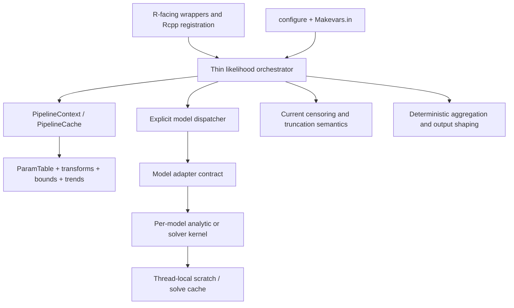

# Behavior-Preserving C++ Architecture Refactor Plan

## 1. Objective

Refactor the current EMC2 C++ implementation so that its build and source architecture are closer to `/data/work/EMC2_cens_trunc2/`, while preserving the current package's complete behavior.

The refactor is intended to:

- split the monolithic C++ orchestration and header-heavy model implementation into independently compilable translation units;
- reduce rebuild scope and package build time;
- make model, likelihood, solver, parameter-mapping, and Rcpp-boundary responsibilities explicit;
- preserve useful optimization (contiguous buffers, precomputed mappings, cached numerical solves, inlining of genuinely hot scalar cores);
- introduce a controlled OpenMP strategy, including evaluation of `#pragma omp simd` versus `#pragma omp parallel for`/parallel regions;
- reduce reliance on forced `-O3 -march=native -ffast-math` flags where measured performance and numerical equivalence permit it.

This is a **code-structure and build refactor only**. It must not change the numerical behavior of likelihood functions, public R-facing behavior, supported data conventions, model inventory, solver inventory, or random-generation semantics.

## 2. Non-negotiable scope constraints

### Must remain unchanged

1. **All current models and variants remain supported.** This includes, at minimum, the analytic race families, BAwL/BAwD/BAwF/BAwDp/BAwR/BTAwL variants, FRQ, RDM/GBM/RDMSWTN/timed and correlated variants, LNR/REXG/PCOUNTER, RLF, GOM, ROU/ROUp, BOU, DDM, MRI/fMRI, SDT/hUVSD, stop-signal models, SOFTMAX/ordered/multinomial paths, Volterra diffusion models, contaminant/guess/timer/capacity variants, and current solver-backed architectures.
2. **All current solver implementations remain available.** Do not replace or remove FPE, Volterra, RLF, quadrature, GSL/hcubature, Gaussian/BVN, or related numerical paths merely because the reference package organizes them differently.
3. The existing R-facing interfaces and generated registration must remain compatible, including `calc_ll_oo`, `calc_ll_oo_pw`, marginal-likelihood entry points, parameter wrappers, model RNG entry points, counters, probes, and other current `[[Rcpp::export]]` functions.
4. Current parameter names, parameter ordering, column registries, model-name suffix dispatch, bounds, transforms, censoring/truncation fields, trial expansion/compression, and data attributes remain compatible.
5. Current likelihood numerical output is preserved. This includes finite, censored, truncated, missing/`NA`, `-Inf`, `+Inf`, defective-tail, guess, contaminant, timer, logical-rules, correlated, PDE, Volterra, and marginalization paths.
6. The current package's data conventions remain authoritative.
- The current RT encoding is part of the contract: preserve the meaning of `rt = -Inf` (lower censoring), `rt = +Inf` (omission/upper-censoring behavior as currently interpreted), `rt = NA` (undirected missing response), and the existing `LT`, `UT`, `LC`, and `UC` columns. Any extracted censor/truncation module must encode these current rules directly.

### Explicitly out of scope

- Do **not** adopt the reference package's `missingness` column or its `missingness == 0` participation convention.
- Do **not** adopt reference-only data-key or design-cell conventions.
- Do **not** remove additional models, solver architectures, model variants, fallback implementations, or current R functionality because they are absent from `/data/work/EMC2_cens_trunc2/`.
- Do **not** change likelihood formulas, approximation order, quadrature nodes, solver discretization, tail handling, or reduction semantics as part of modularization.
- Do **not** mechanically replace every `#pragma omp simd` with a parallel directive. Parallel reductions and changed floating-point evaluation order can change results.
- Do **not** weaken numerical tests to conceal a regression.

## 3. Evidence and baseline architecture

### Current repository

The current package has several high-cost compilation dependencies:

- `src/particle_ll.cpp` is approximately 12,210 lines / 538 KB and includes essentially every model and utility header near the top (`src/particle_ll.cpp:1-21`). It contains the parameter pipeline, adapters, likelihood implementations, marginalization, raw kernels, probes, counters, and many Rcpp exports.
- Large model headers contain substantial implementation bodies and exported wrappers, including `src/model_RDM.h`, `src/model_LBA.h`, `src/model_RLF.h`, `src/model_BAwD.h`, `src/model_BAwF.h`, `src/model_BM_Volterra.h`, `src/model_OU_Volterra.h`, and the stop-signal headers.
- `src/utils.h` is approximately 3,370 lines / 151 KB and itself includes model and solver headers (`src/utils.h:1-18`), making it a broad recompilation hub. It also owns shared function-pointer types and large context structures (`src/utils.h:21-223` and later sections).
- `src/RcppExports.cpp` is approximately 4,045 lines / 246 KB, consistent with many exports being discovered from implementation-heavy files and headers.
- `src/col_registry.h` already provides a useful single source of truth for required parameter-column order and variant-specific optional columns (`src/col_registry.h:7-15`, `25-306`). It should become an explicit contract at the model-dispatch boundary rather than being duplicated.
- Current `src/Makevars`, `src/Makevars.win`, and `src/Makevars.ucrt` force aggressive flags. The main Makevars uses `-O3 -march=native -ffast-math -fno-finite-math-only -fno-math-errno -DUSE_FAST_PNORM` (`src/Makevars:5-25`); the Windows variants repeat the forced optimization profile.
- `-fno-finite-math-only` is intentionally present because `NA_REAL`/NaN and infinities participate in censoring decisions. Any flag change must preserve those comparisons.
- `src/particle_ll.cpp` contains explicit `#pragma omp simd` reductions, for example around lines 2579, 2892, 5142, 7526-7550, and 9503-9523, but the current tree has no `_OPENMP`, `omp_get_*`, `fopenmp`, or `SHLIB_OPENMP` references and no OpenMP compile/link flag in `src/Makevars*`. These directives are therefore dormant in the current build; current vectorization comes from the compiler flags. Enabling OpenMP would activate multiple directives at once, including floating-point reductions, so OpenMP activation must be a separately gated behavior change rather than an incidental result of the refactor.
- The current R model specifications document a broad model and variant inventory, including BAwD/BAwF/BAwDp, FRQ, GOM, ROU, RLF, BOU, RDM timer/correlation variants, stop-signal models, and others in `R/model_*.R`.

### Reference repository patterns to adapt selectively

`/data/work/EMC2_cens_trunc2/` demonstrates the desired structural direction:

- model `.h`/`.cpp` pairs with declarations and only small inline cores in headers;
- a smaller `particle_ll.cpp` orchestrator;
- `RaceSpec.h`/`RaceSetup.h` function-pointer boundaries and reusable scratch buffers;
- `ParamTable.h/.cpp`, `TrendEngine.h/.cpp`, `CensorSpec.h/.cpp`, `TruncSpec.h/.cpp`, `kernels.h/.cpp`, `hcubature`, and math utility translation units;
- `CensorSpec`/`TruncSpec` are reference-architecture names and may be used only as inspiration for separation of concerns. If equivalent current-package modules are introduced, they must preserve the current RT/column semantics and must not import the reference's `missingness`-based participation logic.
- a hand-written `configure` that generates `src/Makevars` from `src/Makevars.in`, tests OpenMP availability, and makes fast-math/native options opt-in;
- `pnorm_utils.h` and `math_utils` layers that permit vectorized hot loops without requiring global fast-math;
- an optional build-information endpoint that reports effective compiler and parallel configuration.

The reference still has SIMD loops and particle-level OpenMP loops. Its architecture is therefore evidence for **modular boundaries and explicit parallel scopes**, not evidence that its numerical implementation or data conventions can be copied wholesale.

## 4. Target architecture

The target should have these boundaries:

1. **Rcpp boundary:** thin wrappers in the appropriate `.cpp` files; generated registration remains generated and is not hand-maintained.
2. **Likelihood orchestration:** setup, dispatch, particle iteration, output shaping, and compatibility routing only.
3. **Parameter pipeline:** one implementation of pre-transform, constants, design mapping, trend stages, transform, bound, and materialization behavior.
4. **Model adapters:** explicit required-column specification, variant metadata, function pointers/callables, and model-specific context.
5. **Kernel modules:** one or more `.h`/`.cpp` pairs per model family; only small, proven hot cores remain inline.
6. **Cross-cutting feature modules:** censoring, truncation, quadrature, kernels, numerical utilities, PDE/Volterra solvers, and RNG helpers compiled independently.
7. **Parallel execution layer:** thread-local mutable state and explicit deterministic aggregation.
8. **Build configuration:** generated, platform-aware flags with conservative defaults and measured opt-in performance profiles.

### Cross-cutting design rules (apply to every phase)

- Build an immutable, package-native `DataView`/`TrialLayout` once at the R boundary. It owns copied primitive buffers and index maps needed by kernels, including compression and covariate expansion metadata. No `SEXP`, `Rcpp::Vector`, `Rcpp::Function`, R option lookup, or R allocator call may occur in a worker region. Any worker `ParamTable`/matrix view must be fully constructed before entering the region or backed by detached primitive storage. Keep R objects alive until the view and all results are destroyed.
- Keep Rcpp and C++ standard-library types at the FFI boundary. Internal adapters, scratch, caches, and kernels should use explicit C++17-compatible span-like views/pointers/vectors and ownership-bearing context objects. `Rcpp::XPtr` handles and custom trend/kernel function pointers retain their current finalizers and are invoked only in their currently safe (serial) context unless a documented callback contract is added.
- Make ownership and mutability visible in every context: immutable per-call data, per-particle parameter state, thread-local scratch, shared read-only solver grids, and shared caches with a defined lock/eviction policy. Do not rely on header-local `static` state to provide a cache or counter; moving a function between translation units must not silently change the number of cache instances.
- Preserve reduction order wherever the observable contract requires it. Avoid unordered-container iteration in output-producing paths; give registry entries, model suffix resolution, quadrature nodes, compressed rows, and particle/trial reductions stable ordering. A deterministic tree or fixed chunk order is required before a parallel reduction can replace a serial one.
- Keep non-trivial definitions out of headers. A header may contain declarations, templates, or small `inline`/`constexpr` scalar cores with no mutable global state. Every header must be independently includable; include cycles, accidental transitive dependencies, duplicate non-`inline` definitions, and Rcpp attributes in implementation-heavy headers are refactor blockers.

## 5. Implementation phases

### Phase 0 — Freeze the observable contract before editing

Create a machine-readable inventory and baseline artifacts before moving code:

- enumerate every current Rcpp export and registered symbol from `src/RcppExports.cpp`/`R/RcppExports.R`;
- enumerate every model constructor, `c_name`, suffix, optional parameter, solver route, and fallback route from `R/model_*.R`, `src/col_registry.h`, and the current dispatch code;
- document the exact order of `resolve_race_model_adapter` and its specialized-before-generic cases (currently RLF, GOM/GOMP, ROU/ROUp variants, RDMSWTN_TT, RDMSWTN, GBM, FRQ, BAwF, BAwR, BTAwL, BAwDp, BAwD, BAwL, LBA, RDM, REXG, LNR, and PCOUNTER, with GNG, IO, LogicalRules, timer, and correlation suffix handling), then turn that order into dispatch tests. Also inventory non-race dispatchers for DDM/BOU, SDT/hUVSD, SOFTMAX, ordered/multinomial, MRI/fMRI, and stop-signal paths;
- record the current `calc_ll_oo`, `calc_ll_oo_pw`, marginalization, parameter-wrapper, direct-kernel, RNG, counter, and probe contracts;
- capture representative expected outputs using fixed parameter matrices and fixed data fixtures;
- include ordinary, compressed, censored, truncated, missing/`NA`, infinite-RT, defective-tail, contaminant, guess, timer, logical-rules, correlated, stop-signal, MRI, FPE, RLF, and Volterra cases;
- include explicit RT-code fixtures for `rt = -Inf`, `rt = +Inf`, `rt = NA`, finite RTs, and every combination of current `LT`, `UT`, `LC`, and `UC`; do not encode these cases through a new `missingness` column;
- preserve the existing `expect_snapshot(calc_lls(...))` checks in `tests/testthat/test-likelihoods.R` (for example lines 72-108 and 221-236) and the textual golden values in `tests/testthat/_snaps/likelihoods.md`; these are five-decimal display snapshots with no tolerance parameter;
- add a separate full-precision golden-value RDS harness for old-versus-refactored comparisons, storing inputs, outputs, dimensions, names, attributes, model/variant labels, compiler flags, and platform metadata. The RDS harness is the numerical differential oracle; it must not be replaced by rounded text snapshots;
- run the old and refactored packages from isolated library directories/subprocesses (never two builds of the same DLL in one R session), and record the source revision plus generated build-profile metadata in every RDS result so a comparison cannot accidentally mix artifacts;
- decide now that `_snaps/likelihoods.md` is **not regenerated for this behavior-preserving refactor**. A snapshot diff is a failure to investigate. Regeneration is allowed only for an explicitly approved numerical-contract change outside this refactor, with its rationale and new baseline reviewed separately;
- record current clean-install and incremental rebuild times, compiler flags, object sizes, and whether OpenMP is available;
- record whether existing outputs are bit-for-bit stable across repeated runs and thread counts. Do not assume this; measure it.

**Gate:** no source extraction begins until the inventory and baseline are reviewable. The baseline becomes the differential oracle for every subsequent phase.

### Phase 0A — Add the cross-language, FFI, and runtime-state inventory

The source tree is not the complete interface description. Before extraction, add a machine-readable manifest (checked into the refactor work area or emitted by a reproducible script) with one record for every R model constructor and every direct C++ entry point. The manifest must be generated from both sides and compared, rather than maintained by hand:

- enumerate every `R/model_*.R` constructor, including `BAwR`, `BTAwL`, `ROUp`, `BOU`, `SDT`/`hUVSD`, `SOFTMAX`, ordered/multinomial, and all `LogicalRules`, `GNG`, `_IO`, `_LOGN`, timer, kill, guess, correlation, boundary, and solver suffixes;
- for constructors whose arguments generate a family (`RDMGBM`, `RDMSWTN`/`RDMSWTN_TT`, `ROU`/`ROUp`, `BOU`, BAwD/F/R, BTAwL, and stop-signal options), enumerate every supported legal argument combination or record an explicit equivalence class and representative for each generated `c_name`;
- evaluate each constructor's metadata in a clean R session and record `c_name`, `type`, `p_types`, `p_types_canonical`, optional/nuisance columns, transforms, bounds, `compress_ok`, `rt_resolution`, correlation type, and the R likelihood/simulator route;
- parse `src/col_registry.h` and the C++ dispatcher to record required-column order, optional-column order, context flags, solver/fallback routes, and specialized-before-generic precedence; fail the manifest check when an R model has no C++ route or a C++ route has no R model (unless explicitly classified as a standalone public helper);
- include all `Rcpp::export` functions, generated registration entries, `NAMESPACE` registration/imports, `Rcpp::XPtr` constructors/finalizers, custom-trend callbacks, custom-kernel pointers, runtime-compiled `Rcpp::sourceCpp` users, and any direct `.Call` users. Record the compiler/visibility/include contract exposed to those extensions. Moving an export from a header to a `.cpp` must not alter its symbol, default arguments, ownership, or error behavior;
- inventory every use of R API state from C++ (`Rcpp::Function`, R options, `Rcpp::RNGScope`/`R::r*`, `Rf_*`, callbacks, warnings, `Rcpp::stop`, and `R_CheckUserInterrupt`/`R_ToplevelExec`), every mutable `static`/`thread_local` object, GSL error-handler mutation, solver/quadrature cache, counter, and probe. Classify each as immutable-after-setup, thread-local, lock-protected, serial-only, or requiring a redesigned ownership boundary;
- treat GSL's process-global error-handler API as a separate hazard: establish one package-level policy for disabling/restoring handlers, never mutate it concurrently, and test error recovery after a failed quadrature/solver call;
- record the complete current data layout as a `DataView` contract: `lR`, `R`/`winner`, `rt`, `LT`, `UT`, `LC`, `UC`, `expand`/compression maps, covariate maps, accumulator count, trial count, row order, names, and attributes. Include hybrid/missing accumulator cells and data with unequal or partial trial blocks. The refactor must not infer a one-row-per-accumulator layout from the reference package;
- document the exception and error contract: exact error class/message where tests depend on it, warning timing, GSL failure behavior, and which failures can occur after a worker region begins. Worker code must never throw through an OpenMP region or call R; it must capture the first failure and rethrow on the R-owning thread with the established error contract.

The manifest is a compatibility artifact, not merely a planning note. Regenerate it after each dispatcher or export change and include its diff in the family gate.

**Gate:** the manifest covers every current `R/model_*.R` file and direct export, has no unresolved schema/dispatch/FFI entries, and identifies all code that is forbidden from an OpenMP worker region.

### Phase 1 — Define internal contracts without changing R behavior

Introduce or formalize internal interfaces modeled on the useful parts of the reference package:

- `RaceSpec`/column specification that can represent all current families and variants, not only the reference's smaller catalog;
- reusable `RaceScratch`/workspace structures with explicit ownership and `reserve()`/reuse behavior;
- an explicit race adapter contract for raw density, CDF/survivor, censoring/truncation, and optional fast paths;
- a separate two-boundary adapter contract for DDM and BOU-family paths;
- separate stop-signal and MRI contracts where their data layouts do not fit a race abstraction;
- explicit solver-cache ownership and lifecycle contracts for FPE, RLF, and Volterra implementations;
- context types that separate immutable per-call metadata from mutable per-particle state;
- a dispatcher mapping that preserves the current substring precedence and suffix behavior exactly, including collisions such as specialized model names containing generic names.
- a `DataView`/`TrialLayout` contract that preserves compressed and expanded row maps, covariate maps, partial accumulator blocks, output names/attributes, and the current `lR`/`R`/`winner` conventions without importing the reference package's data model;
- an explicit FFI policy for custom likelihoods, `Rcpp::XPtr` parameter tables, registered trend kernels, R callbacks, and model RNG. These paths must be marked serial-only unless their callback and allocator semantics are independently made thread-safe;
- an error-propagation policy for adapter and solver failures. Rcpp exceptions, warnings, and R API calls stay on the owning thread; worker failures are represented as status objects and rethrown after the parallel region.

The interfaces must accept current `ParamTable`/column layouts and current data semantics. They must not require a `missingness` field.

**Gate:** adapters can be described in a table showing model family, required columns, optional columns, context flags, kernel functions, solver cache, and fallback path. The table must cover every current model and variant.

### Phase 2 — Split shared infrastructure and reduce include coupling

Refactor shared infrastructure before moving model bodies:

1. Split `src/utils.h` into narrowly scoped headers/translation units, for example:
   - function-pointer and adapter contracts;
   - race context and shared state;
   - two-boundary/DDM context;
   - numerical integration helpers;
   - contaminant/guess/timer helpers;
   - model-independent likelihood aggregation;
   - solver-cache interfaces.
   Current-package censoring/truncation semantics should be isolated as a separate concern only if that reduces coupling; do not copy the reference `CensorSpec`/`TruncSpec` data model or add a `missingness` field.
2. Keep `src/col_registry.h` as the authoritative column contract, but move nontrivial implementation out of the header where possible.
3. Move `ParamTable` implementation and parameter mapping hot paths into `.cpp` files while retaining only small, performance-critical inline operations.
4. Isolate `transform_utils`, `TrendEngine`, kernels, quadrature, Gaussian/BVN helpers, NaN/Inf-safe predicates, and data-independent shared-state builders into independent TUs. A reference-style `math_utils`/`pnorm_utils` or `nan_check` layer is acceptable only when it preserves the current `R_FINITE`/`ISNAN` semantics and legacy-compatible pnorm mode.
5. Use forward declarations and narrow includes. Eliminate the current pattern where one umbrella header causes every model to compile into `particle_ll.cpp`.
6. Preserve current `ParamTable` mapping order, NA/Inf handling, design masks, trend premap/pretransform/posttransform stages, invariant-column optimization, and materialization order.
7. Establish an include/definition policy before extraction: every new header must compile in a standalone include test; every non-template function or mutable object has one owning `.cpp`; exported wrappers are not left in implementation-heavy headers; and `inline`/`static` changes are reviewed for ODR, cache-cardinality, and counter-reset effects. Keep Rcpp attribute/plugin directives in deliberately chosen `.cpp` files so `compileAttributes()` still discovers exactly one declaration for each export.
8. Separate cache interfaces from cache storage. For GSL workspaces, Gaussian/quadrature tables, FPE/RLF/ROU/GOM solve caches, and debug counters, specify whether state is per-call, per-thread, or process-shared, how it is reset, its memory bound, and its synchronization. A cache hit must not depend on unordered iteration or on a model header being included in a particular translation unit.

**Gate:** a change to one shared feature rebuilds only its intended object set plus dependent objects; all baseline likelihood and wrapper comparisons remain unchanged.

### Phase 3 — Extract model families into translation-unit pairs

Perform mechanical extraction in small, reviewable groups. Move existing function bodies without changing formulas or branch order. Keep tiny scalar cores inline only when profiling and compiler output justify it.

Recommended order:

1. **Low-risk analytic race exemplars:** LNR, LBA/LBAIO, RDM, and ex-Gaussian/REXG. Use the reference's gather-compute-scatter pattern and contiguous scratch buffers.
2. **Shared ballistic families:** BAwL, BAwL lognormal/correlated/timer variants, BAwD, BAwD lognormal/gamma/rho variants, BAwDp, BAwF, BAwR, and BTAwL transient/sustained variants. Centralize shared geometry only where the existing formulas are demonstrably identical; do not change model-specific parameter interpretation or suffix-selected column layouts.
3. **Counter and finite-reservoir families:** PCOUNTER, FRQ, RDMGBM, RDMSWTN, RDMSWTN_TT, Erlang timer/guess/kill variants, and correlated-time/drift routes.
4. **Specialized race/PDE families:** RLF, ROU and ROUp parameterizations/boundary forms, GOM/GOMP, and related FPE caches.
5. **Two-boundary and diffusion families:** DDM, BOU, BM/OU Volterra, and their fallback/solver entry points.
6. **Stop-signal and other non-race paths:** SSEXG, SSRDEX, SDT/hUVSD, SOFTMAX, MRI/fMRI, and any ordered or multinomial paths. Preserve their distinct data schemas and do not force them through a race adapter merely to reduce the number of interfaces.
7. **RNG modules:** preserve `model_rng.cpp/.h` as a separate boundary; split only where it reduces coupling, retaining exact RNG call order and output packing.

Each model family should expose declarations in a small header and implementations in a `.cpp`. Direct Rcpp-exported scalar/vector helpers currently embedded in model headers should move to their family `.cpp` or a dedicated wrapper `.cpp`, with no signature changes.

**Per-family acceptance criteria:**

- required and optional column order matches `src/col_registry.h` and the R model specification;
- all old model-name variants route to the same kernel and context flags;
- raw, fallback, censoring, truncation, and survivor paths remain available;
- no new allocation occurs in the hot loop unless the old path allocated there;
- direct model wrappers and likelihood outputs match the Phase 0 oracle;
- only the intended model objects rebuild after a model-source edit.
- any R API, callback, RNG, cache, counter, and solver ownership assumptions are recorded in the manifest and remain within the permitted execution context;
- moving an attribute-marked wrapper out of a header produces one definition, one generated registration entry, and no change to default-argument behavior.

### Phase 4 — Replace the monolithic orchestration with a thin dispatcher

After the model modules are independently compilable:

- reduce `particle_ll.cpp` to R-facing likelihood orchestration, shared setup, dispatch, particle-loop control, and output assembly;
- construct per-call pipeline state once and reuse it across particles;
- resolve model metadata once per call, including column specs, variant flags, solver-cache configuration, and fast/fallback eligibility;
- make the current `calc_ll_oo`, `calc_ll_oo_pw`, marginalization, and parameter-wrapper paths share setup code without changing their output contracts;
- retain a compatibility/reference path until differential tests pass for each migrated family;
- move counters, probes, and debug exports out of the orchestrator unless they genuinely belong to its public boundary;
- ensure the orchestrator never depends on model implementation headers beyond the adapter declarations;
- build the immutable `DataView`/`TrialLayout` and all data-only masks once, then hand only primitive/read-only views plus thread-local mutable contexts to workers. Preserve row order, compression expansion, covariate maps, names, attributes, and sentinel values when assembling the output;
- keep custom R callbacks, `Rcpp::Function`, R option lookups, `Rcpp::XPtr` mutation, and R RNG calls on a serial/owning-thread route. If a future parallel route needs them, introduce a separate callback/seed contract rather than calling them opportunistically from a worker;
- represent worker errors as a status/error record, stop launching additional work, join the region, and rethrow with the established Rcpp error class/message. No exception may escape through an OpenMP runtime and no worker may call `Rcpp::stop`, `warning`, allocation, or `Rprintf`;
- preserve current user-interrupt behavior (`R_CheckUserInterrupt`/`R_ToplevelExec`) by polling on the R-owning thread and using a cancellation flag for workers. Do not call R's interrupt machinery from an OpenMP worker.

The dispatcher may replace a long substring chain with a registry or explicit ordered resolver, but the old precedence must be encoded and tested. A cleaner dispatch table must not silently reinterpret a current `c_name`.

**Gate:** the orchestrator contains no model formula implementation, and all current model families are reachable through the new adapter table.

### Phase 5 — Establish the parallel execution policy

Treat parallelism as a separate, measured change after serial modularization is proven.

1. **Record the current state before activation:** the repository currently has no OpenMP compile/link flags or OpenMP runtime references, so its `#pragma omp ...` sites are ignored by the compiler. Capture a serial baseline with the existing flags and confirm that adding OpenMP is not bundled silently with source modularization.
2. **Compile-time/runtime detection:** add a configure-driven OpenMP compile test with a serial fallback when OpenMP is unavailable, while initially emitting an OpenMP-disabled build. Keep platform handling for Linux, macOS, Windows, and UCRT explicit.
3. **Separate SIMD from threading:** test a SIMD-only profile (`-fopenmp-simd` or the compiler equivalent) separately from full OpenMP. Do not link an OpenMP runtime merely to enable `#pragma omp simd`, and do not assume that enabling SIMD directives makes a reduction numerically interchangeable with the legacy compiler-vectorized loop.
4. **Gate activation separately:** after serial modularization passes the golden-value harness, build an otherwise identical OpenMP-enabled variant with `-fopenmp` (or the platform-specific equivalent). Differential-test it before allowing any current `simd` or future `parallel for` directive to execute. In particular, test every existing reduction site and confirm whether output must be bitwise identical, deterministically reduced, or serial-only.
5. **Safe parallel scope:** prefer parallelizing independent particles or independent contiguous work units after all R API and shared setup work is complete. Do not call R/Rcpp allocation or non-thread-safe R math from worker regions.
6. **Thread-local state:** each worker must own or rebind its `ParamTable`, scratch buffers, censor/truncation workspaces, solver-cache mutable state, and model contexts. Immutable shared data may be read-only.
7. **Nested parallelism:** avoid nested OpenMP regions and coordinate with existing R-level worker pools and BLAS/Armadillo thread settings so the package does not oversubscribe CPUs. Record the effective thread budget and test the package with single-threaded BLAS as well as the default BLAS configuration.
8. **RNG and callback boundary:** `model_rng.cpp` and any Volterra/OU simulator that calls `R::r*` or enters R must remain on the serial R-owned path by default. Preserve `RNGScope`, `RNGkind`, draw order, omission encoding, and output packing. Do not call R's RNG or an `Rcpp::Function` from an OpenMP worker. A separately designed counter-based/per-particle stream may be evaluated later, but it is a new stochastic contract and cannot silently become the default.
9. **Mutable observability state:** counters, probes, debug print budgets, and process-level options must retain current reset and visibility semantics. Make them serial-only, thread-local with deterministic merge, or lock/atomic-protected as appropriate; test repeated calls and parallel calls for both values and reset behavior.
10. **SIMD versus parallel:** classify every current SIMD loop as one of:
   - retain SIMD because it is a local contiguous vector operation;
   - promote to `#pragma omp parallel for` or an equivalent parallel region because iterations are independent and work is sufficiently large;
   - use a fixed-chunk parallel implementation with deterministic combination because it is a reduction;
   - leave serial because branchiness, small size, solver state, or numerical ordering makes parallelism unsafe.
11. **Reduction contract:** never use an unordered floating-point reduction where output preservation requires a stable sum. Use fixed-order chunk accumulation, a deterministic tree, or retain the original reduction path. Test likelihood sums separately from per-trial kernel values.
12. **Directive policy:** use valid OpenMP syntax (`#pragma omp parallel`, `#pragma omp for`, `#pragma omp parallel for`, and `#pragma omp simd` as appropriate). Do not interpret “parallel” as a textual replacement for “simd.”
13. **Thread-count verification:** compare one-thread, multi-thread, repeated, and OpenMP-disabled results. Verify no races with sanitizers or race-detection tooling where supported, and exercise cancellation/interruption while a large call is in flight.

**Gate:** parallel execution is opt-in or conservatively defaulted only after speedup, determinism, and numerical-equivalence evidence exists for each path. Unsupported paths fall back to the proven serial implementation.

### Phase 6 — Make compiler flags configurable and less aggressive by default

Add a current-package `configure`/`src/Makevars.in` flow inspired by the reference, but preserve current numerical behavior rather than copying its flags blindly.

Required steps:

1. Generate build settings from the compiler actually selected by R.
2. Detect OpenMP and emit both compile and link flags only when the probe succeeds.
3. Preserve C++17, RcppArmadillo, bundled-GSL include/link behavior, required Windows settings, and platform-specific BLAS/LAPACK behavior.
4. Replace unconditional `override CXXFLAGS` with named profiles:
   - **compatibility/default:** conservative optimization and no architecture-specific assumptions;
   - **performance:** opt-in native/vectorization settings;
   - **diagnostic:** compiler vectorization and optimization reports.
   Define one canonical selector (for example `--with-build-profile=` plus documented environment overrides), reject conflicting profile/flag combinations, and record the resolved profile in generated build metadata so a benchmark can be reproduced.
5. Stage removal of `-ffast-math`, `-march=native`, and `-fno-math-errno` independently. Do not remove them as a single unverified change.
6. Replace `USE_FAST_PNORM` only through a compatibility-tested configuration mechanism. A reference `PNORM_MODE=1` implementation must not become the default unless its output is proven equivalent to the current path for all affected likelihoods. If exact equivalence is impossible, retain a legacy-compatible mode as the default and document alternate modes as explicitly non-default.
7. Preserve correct NaN/Inf comparisons. If any fast-math profile remains available, retain the equivalent of `-fno-finite-math-only` and test censoring paths specifically.
8. Add build provenance reporting only if it does not alter public behavior; report effective pnorm mode, OpenMP availability, fast-math/native profile, and compiler flags for diagnosis.
9. Add and test the complete generated-build lifecycle: POSIX `configure`, Windows/UCRT `configure.win` (including a no-configure fallback), `src/Makevars.in`, any generated configuration header, and `cleanup` rules. Configure must use the compiler selected by R, quote user flags, use a collision-safe temporary directory, clean probes on success/failure, and never assume that a POSIX shell or `/tmp` is available on Windows. Keep generated files distinguishable from hand-edited sources, define their `.Rbuildignore`/source-tarball treatment, and ensure source installs, binary installs, and `R CMD SHLIB` all use the same profile semantics.
10. Keep C and C++ compilation separate. Bundled GSL C sources must not accidentally inherit C++-only flags or C++17 requirements; preserve `PKG_CFLAGS`, include paths, BLAS/LAPACK/RcppArmadillo linkage, `R_NO_REMAP`, and platform-specific library ordering while changing `CXXFLAGS`.
11. Add a build-profile compatibility note to `Agents.MD`, `NEWS.md`, and package/build documentation before changing the default. The current contributor guidance says the aggressive flags are required; until that guidance is updated and the profile matrix passes, retain a named legacy profile and do not silently reinterpret it as the conservative default.

**Flag acceptance matrix:** build and compare at least the current legacy profile, conservative default profile, OpenMP-disabled profile, OpenMP-enabled profile, and opt-in performance profile on supported toolchains. Differences must be explained by the profile and must not affect the default numerical contract.

### Phase 7 — Regenerate the Rcpp boundary and remove obsolete coupling

After all exports have moved to appropriate implementation files:

- run the repository's normal Rcpp attribute generation process;
- verify that every prior registered symbol remains present with the same R-level signature;
- keep `RcppExports.cpp` generated and do not hand-edit it;
- update only generated artifacts required by the moved export locations;
- remove duplicate wrappers and obsolete forward declarations after all callers are migrated;
- keep direct probes, counters, model RNG, custom trend, group-design, and parameter-table interfaces available exactly as before.
- run attribute generation from the package root in a clean tree and diff `R/RcppExports.R`, `src/RcppExports.cpp`, `NAMESPACE`, and any generated documentation. Verify that registration remains enabled, no wrapper is compiled twice, no header-only export disappeared from the scanner, and no new R-visible symbol was introduced accidentally;
- test `Rcpp::XPtr` finalizers, custom trend registration, `register_kernel`/custom function pointers, and direct `.Call` users across unload/reload and garbage-collection boundaries. A source split must not leave an external pointer referring to a destroyed TU-local object or change symbol visibility.

**Gate:** an export inventory diff shows no unintended additions, deletions, renames, signature changes, or registration changes.

### Phase 8 — Performance, build-time, and maintenance validation

Measure the refactor rather than relying on source appearance:

- clean build wall time and CPU time;
- incremental rebuild after touching one model `.cpp`;
- incremental rebuild after touching shared parameter/trend code;
- number and aggregate size of rebuilt objects;
- package load time and shared-library size;
- likelihood throughput by model family and by serial/multi-threaded path;
- end-to-end representative fits (`init_chains`/`run_emc`, particle adaptation, marginalisation, and the existing R worker-pool configurations), not only isolated kernel calls; report wall time per iteration and effective samples per unit time where the fixture is stable;
- allocations in representative hot loops;
- solver-cache hit/miss behavior;
- vectorization and OpenMP reports for selected kernels.

Use a reproducible benchmark harness with checked-in fixtures and record compiler, R version, platform, CPU model, thread environment, profile, warm-up policy, allocation counters, and at least three timed repetitions (report median and spread). Measure both cold clean builds and targeted rebuilds with the same `-j` setting; do not claim a compile-time win from a different machine, cache state, or job count. Add a debug validation matrix with AddressSanitizer/UndefinedBehaviorSanitizer where supported and ThreadSanitizer for OpenMP-enabled paths; sanitizer failures, data races, invalid lifetime, and leaked worker errors are release blockers even when numerical outputs happen to match.

Agree on quantitative acceptance thresholds before implementation and keep them fixed for the comparison (a useful starting point is at least a 20% clean-build wall-time reduction, a model-only edit rebuilding no more than 25% of the prior object set, and no more than a 5% median likelihood-throughput regression in the conservative profile). If a threshold is missed, record whether the cause is unavoidable numerical safety, a cache/lifetime trade-off, or an avoidable dependency and resolve the latter before completion.

The refactor is successful only if it materially reduces clean and incremental build cost without regressing representative likelihood throughput. A slower path is acceptable only when required for numerical correctness and documented with evidence; avoidable regressions must be fixed before completion.

## 6. Verification matrix

### Numerical differential tests

Run old and refactored builds side by side against identical inputs. Compare:

- direct scalar/vector density, CDF, survivor, and RNG wrappers;
- `calc_ll_oo` and `calc_ll_oo_pw` per-particle and trialwise results;
- marginal likelihood values and quadrature-node outputs;
- `get_pars` and bound/transform validity outputs;
- compressed and uncompressed data;
- all censoring/truncation combinations using the current `LT`, `UT`, `LC`, `UC`, `rt`, `R`, `lR`, `winner`, and related columns;
- `NA`, `-Inf`, `+Inf`, omitted responses, defective distributions, contaminants, guesses, timers, GNG, logical rules, capacity, correlations, stop-signal, MRI, FPE, RLF, and Volterra paths;
- boundary values and fallback thresholds (`k == 0`, zero variability, infinite parameters, zero/near-zero scales, finite/infinite cutoffs).

The existing `expect_snapshot` checks are an exact textual compatibility gate, not a tolerance-based comparison: they render values to five decimal places and `expect_snapshot` has no tolerance knob. Keep them unchanged and treat any diff as a failure. Use the separate full-precision RDS harness for bitwise comparisons and for declared, platform-specific absolute/relative tolerances only where the baseline demonstrates unavoidable compiler/platform variation. Never broaden snapshot output or tolerance to conceal a refactor regression.

### API and dispatch tests

- compare the complete export inventory;
- compare the generated cross-language model/schema manifest, including every current `R/model_*.R` constructor and every suffix-selected route;
- instantiate every current R model constructor and variant;
- verify every `c_name` suffix and dispatch precedence;
- verify required/optional column diagnostics and parameter ordering;
- verify unsupported combinations continue to fail with the same class of error;
- verify current data schemas remain accepted and no `missingness` column is required or injected;
- verify compressed, expanded, covariate-mapped, and partial/hybrid trial layouts through the `DataView`/`TrialLayout` boundary;
- verify output dimensions, names, attributes, and sentinel values;
- verify `Rcpp::XPtr` finalizers, custom trend/kernel callbacks, R option lookups, Rcpp exceptions/warnings, and direct `.Call` callers after source movement.

### Parallelism and build tests

- OpenMP present and absent;
- one and multiple worker threads;
- repeated calls with identical inputs;
- nested R worker-pool scenarios;
- R RNG and simulator paths under repeated seeds, `RNGkind`, and OpenMP-disabled/enabled builds; R RNG calls and R callbacks must remain on the documented serial path;
- counters, probes, cache reset behavior, and error propagation when a worker fails;
- representative end-to-end fitting fixtures with `cores_per_chain`, `cores_for_chains`, marginalisation, and worker-pool settings used in production;
- Linux/GCC, macOS/Clang where available, Windows/UCRT where available;
- conservative and opt-in performance flag profiles;
- clean and targeted incremental rebuild measurements.

Run the repository's focused tests after each family migration, then the complete package test suite and package-check workflow only after all phases are integrated.

## 7. Recommended commit stack

The commits below are intentionally organized around reusable interfaces and shared data, not around individual files. A declaration, its owning implementation, focused tests, and required generated metadata travel together. Every commit must build, pass the relevant gate, and be independently revertible. Do not create declaration-only, implementation-only, test-only, or generated-only commits unless the generated change is the mechanical result of the same source change.

### Commit rules for the whole stack

- Start each commit from the preceding green state; avoid drive-by formatting or formula cleanup.
- Introduce a shared primitive exactly once in the earliest commit that can own it. Later model commits consume that primitive rather than growing local copies or compatibility wrappers.
- Keep one compatibility implementation path while a family is being migrated, selected behind an internal adapter/compile switch if necessary. Do not maintain two formula implementations or two data-semantic paths.
- When an exported function moves, move its declaration, definition, attribute, registration regeneration, and direct-wrapper test in the same commit. Run a final clean `compileAttributes()` pass after the last move.
- Keep the legacy compiler profile and serial execution available until the complete serial differential matrix passes. OpenMP, fast-math removal, native tuning, and default-profile changes are separate commits.
- Record the commit's changed object set, focused tests, numerical diff, and build-time delta in the refactor log. A commit that changes a shared header must list every dependent object deliberately rebuilt.

The earlier phases remain the design and verification requirements; this stack is the implementation order: Phase 0/0A maps to C0, Phase 1–2 to C2–C5, Phase 3 to C6–C10, Phase 4 to C11–C12, Phase 5 to C13, Phase 6 to C1 and C14–C16, and Phase 7–8 to C6–C17 plus the final release gate.

### Commit sequence

| Commit | Scope and shared outcome | Depends on | Required gate before continuing |
|---|---|---|---|
| **C0 — Freeze baseline and create the oracle** | Add the cross-language model/schema/export manifest, isolated old-versus-new RDS harness, fixed data fixtures, snapshot policy, build-time/throughput benchmark fixtures, and source/profile provenance. No production behavior changes. | None | Inventory has no unresolved model, suffix, export, FFI, data-layout, or runtime-state entries; baseline package tests and benchmark runs are archived. |
| **C1 — Add build/profile scaffolding without changing defaults** | Add `configure`, `configure.win`, `src/Makevars.in`, generated configuration metadata, cleanup/source-tarball rules, legacy/compatibility/performance/diagnostic profile selectors, compiler/OpenMP/SIMD probes, and optional build-info reporting. Keep the current legacy flags and OpenMP-disabled serial behavior as the default. | C0 | Clean install, `R CMD SHLIB`, Windows/UCRT fallback, generated-file cleanup, and C/C++ flag separation work; C0 outputs are unchanged under the legacy profile. |
| **C2 — Establish the narrow type, ownership, and include layer** | Add C++17-compatible view types (`DataView`/`TrialLayout`), stable model metadata/registry contracts, `RaceSpec`/`RaceSetup` declarations, scratch/workspace ownership, error/status records, cache-key interfaces, and standalone-header/include tests. Keep definitions minimal and do not move formulas yet. | C1 | Every new header compiles independently; no duplicate definitions or transitive model includes are introduced; a no-op package build produces the C0 oracle. |
| **C3 — Extract the parameter and trend pipeline once** | Move `ParamTable`, transform/bounds, `TrendEngine`, custom-trend interface, design masks, materialization, and invariant-column planning into their owning translation units. Preserve mapping order, compressed design expansion, NA/Inf handling, trend stages, XPtr lifetime, and interrupt/error behavior. | C2 | Parameter-wrapper, trend, map, compressed-design, custom-trend, and `get_pars` tests match C0; touching this code rebuilds only the pipeline dependents. |
| **C4 — Build the shared likelihood execution substrate** | Implement the immutable `DataView`/`TrialLayout` builder, current censor/truncation semantics, deterministic aggregation/output shaping, `RaceScratch`, raw adapter function-pointer boundaries, contaminant/guess/timer primitives, common drift/correlation/capacity helpers, and thread/ownership-neutral per-call setup. This is the single shared home for data-only masks and reusable scratch. | C2, C3 | All current RT/censor/truncation/omission/missing/compression fixtures match C0; no reference `missingness` convention appears; no per-particle R allocation or duplicate common helper remains. |
| **C5 — Extract shared numerical and solver substrate** | Move NaN/Inf-safe predicates, pnorm modes, log-space utilities, quadrature/Gaussian/BVN helpers, GSL wrappers, kernel math, solver-cache lifecycle, and FPE/Volterra cache interfaces into narrow TUs. Keep legacy numerical branches and discretizations unchanged; separate cache storage from model adapters. | C2, C4 | Direct numerical helper tests, cache reset/error recovery, sanitizer checks, and full-precision comparisons pass under the legacy profile; cache ownership/cardinality is documented. |
| **C6 — Migrate low-risk analytic race families** | Extract LNR, REXG, LBA/LBAIO, and ordinary RDM into `.h`/`.cpp` pairs using the shared race substrate. Move their direct Rcpp wrappers with each family, retain raw/fallback/survivor paths, and register exact column contracts in the common registry. | C4, C5 | Direct density/CDF/survivor wrappers, finite/censored/truncated likelihoods, dispatch precedence, snapshots, RDS oracle, and targeted rebuild measurements pass for these families. |
| **C7 — Migrate shared ballistic families as one geometry layer** | Extract BAwL, BAwD, BAwF, BAwR, and BTAwL together with shared launch distributions, geometry, decay/fade, log quadrature, and family-specific composition over the common timer/correlation primitives. Keep model-specific parameter meanings and suffix layouts in family adapters; do not fork shared geometry into per-model copies. | C4, C5, C6 | All BAwL/D/F/R/BTAwL variants, launch modes, timers, correlations, fallbacks, and direct wrappers match C0; shared geometry has one implementation and allocation behavior is no worse. |
| **C8 — Migrate finite-clock, counter, and correlated race routes** | Extract PCOUNTER, FRQ, RDMGBM, RDMSWTN, RDMSWTN_TT, Erlang guess/kill/timer variants, logical-rules capacity paths, and correlated time/drift routes. Reuse the clock, drift-factor, contaminant, and deterministic reduction modules from C4/C7. | C4, C5, C7 | Every generated constructor/suffix and unsupported combination is tested; RNG simulators remain serial and distributionally compatible; correlated and logical-rule numerical fixtures pass. |
| **C9 — Migrate FPE-backed race families** | Extract RLF, ROU, ROUp, GOM/GOMP, and their FPE/grid/Toeplitz/solve-cache routes. Share solver interfaces and cache lifecycle from C5 while retaining each model's parameterization, boundary form, interpolation, and fallback behavior. | C4, C5 | RLF/ROU/ROUp/GOM direct wrappers, solver/fallback paths, cache hit/miss behavior, boundary cases, and full-precision likelihood comparisons pass. |
| **C10 — Migrate two-boundary, Volterra, and non-race families** | Extract DDM, BOU, BM/OU Volterra, MRI/fMRI, SSEXG/SSRDEX, SDT/hUVSD, SOFTMAX, ordered/multinomial, and any remaining specialized paths. Preserve their distinct data contracts; do not force non-race models through the race adapter. Keep model RNG in its separate serial boundary. | C4, C5 (can be developed independently of C9) | All remaining model/solver/wrapper inventory entries are reachable; direct and likelihood tests, RDS comparisons, R RNG behavior, and specialized data-schema tests pass. |
| **C11 — Activate the thin dispatcher and orchestrator** | Replace the formula-heavy `particle_ll.cpp` path with the shared pipeline, immutable data view, ordered adapter registry, per-call metadata resolution, thread-neutral particle control, deterministic output assembly, and compatibility routing. Remove model implementation includes from the orchestrator. | C6–C10 | The orchestrator contains no model formulas; all routes resolve through one registry; complete serial package tests, export/dispatch manifests, snapshots, and RDS oracle match C0. |
| **C12 — Consolidate serial efficiency and remove accidental coupling** | With all families on the new path, profile allocations, cache reuse, inline boundaries, include dependencies, object rebuilds, and reduction order. Remove temporary shims and duplicate helpers, coalesce shared scratch/cache setup, and fix avoidable regressions before enabling threads. | C11 | Clean and targeted rebuild thresholds are met or have documented causes; conservative serial fitting throughput is within the agreed limit; no compatibility-only duplicate path remains except the explicitly retained legacy profile. |
| **C13 — Enable SIMD-only and OpenMP execution as separate opt-ins** | Add SIMD-only flags where supported, then thread-level particle/work-unit parallelism, thread-local contexts, deterministic reductions, cancellation, worker error capture, BLAS/thread-budget coordination, and OpenMP-disabled fallback. Keep R/RNG/callback/interrupt operations on the owning thread. | C12 | OpenMP present/absent, one/many threads, nested R worker pools, repeated calls, interruption, sanitizer/race, counters, caches, and full numerical differential tests pass. |
| **C14 — Remove global fast-math from the default** | Make removal of `-ffast-math`/`-fno-math-errno` from the default a standalone, reversible profile change. Retain the legacy and performance profiles unchanged; preserve `-fno-finite-math-only` semantics and the current pnorm mode. | C13 | NaN/Inf/censoring snapshots, full-precision oracle, end-to-end fitting benchmark, and flag acceptance matrix pass with no unexplained regression. |
| **C15 — Remove native architecture assumptions from the default** | Make removal of `-march=native` from the default a separate profile change. Keep native/vectorization opt-in and verify that the conservative path still meets fitting-speed targets. | C14 | Cross-platform builds, direct-kernel and end-to-end throughput comparisons, and clean/incremental build measurements pass. |
| **C16 — Finalize optimization/pnorm defaults and provenance** | Choose the tested default optimization level and pnorm mode (retaining the legacy-compatible mode when equivalence is not proven), update generated build-info metadata, and document the profile contract. No unrelated source restructuring belongs here. | C15 | Complete profile matrix, numerical oracle, reproducible build-info output, and `Agents.MD`/`NEWS.md` review pass. |
| **C17 — Regenerate package integration and remove obsolete coupling** | Run a clean final `compileAttributes()`, regenerate `RcppExports`/`NAMESPACE`/documentation, update source-tarball and cleanup rules, remove the monolithic/duplicate path and stale includes, and run the complete package-check/release matrix. | C16 | End-to-end fitting benchmarks, `R CMD check`, source/binary installs, generated-export diff, sanitizer/portability matrix, and final ownership/inventory audit pass. |

### Shared-component ownership map

| Shared component | Single owning commit | Consumers |
|---|---|---|
| `DataView`/`TrialLayout`, compression maps, row/attribute preservation | C2 declaration, C4 implementation | Orchestrator, censor/truncation, every model adapter, worker setup |
| `ParamTable`, transforms, bounds, trends, custom-kernel pointers | C3 | Orchestrator, all model adapters, parameter wrappers |
| `RaceSpec`, `RaceSetup`, `RaceScratch`, raw adapter signatures | C2 declaration, C4 implementation | Analytic, ballistic, counter, and FPE race families |
| Censor/truncation, contaminant/guess/timer, drift/correlation/capacity primitives | C4 | All race families and logical-rule routes |
| NaN/Inf checks, pnorm modes, log-space math, quadrature/Gaussian/BVN helpers | C5 | All analytic and solver kernels; build profiles |
| Solver/cache lifecycle and deterministic cache keys | C5 | RLF/ROU/ROUp/GOM, DDM/BOU, Volterra |
| Ballistic geometry and launch/decay composition | C7 | BAwL/D/F/R, BTAwL, LBA-compatible fast paths |
| Erlang/timer/correlation composition | C4 | BAwL family, RDMGBM/RDMSWTN/timed routes |
| Ordered adapter registry and output aggregation | C2 declaration, C11 activation | Every model family and R-facing likelihood entry point |
| Thread-local context, error capture, cancellation, thread budget | C2 declaration, C13 implementation | Orchestrator and all eligible parallel paths |

The ownership map is a guard against duplicate “temporary” helpers. If two families appear to need the same primitive, move that primitive backward to the earliest common commit rather than copying it forward.

### End-product efficiency invariants

The final tree should make the efficient path the natural path, rather than relying on contributor discipline or profile-specific luck:

- **Compile-time:** leaf kernel TUs include contracts, math, and their own family headers only; the orchestrator never includes formula-heavy headers; high-fan-out headers contain declarations and small inline cores only; each shared primitive has one implementation and one owner.
- **Setup-time:** data-only parsing, compression expansion, column lookup, model suffix resolution, trend-plan filtering, masks, solver-grid construction, and scratch reservation happen once per call or data set—not once per particle or trial.
- **Hot-loop:** particle kernels operate on detached contiguous buffers and cached integer indices; no `SEXP`/Rcpp construction, string lookup, dynamic allocation, R callback, or substring dispatch occurs in the trial loop; raw fast paths and fallback paths share the same adapter contract.
- **Cache/state:** immutable grids are shared read-only, mutable solver/scratch state is thread-local, cache keys are stable and bounded, and cache resets cannot depend on translation-unit inclusion order.
- **Numerics:** SIMD and threading are selected from measured loop classifications; reductions have an explicit order; fast-math/native/pnorm choices are named profiles; the conservative default is reproducible and preserves NaN/Inf semantics.
- **Concurrency:** the package honors the outer R worker-pool budget, BLAS thread settings, cancellation, and serial-only R/RNG/callback boundaries without oversubscription or hidden global state.
- **Maintenance:** the manifest, ownership map, standalone-header checks, export diff, and targeted rebuild benchmark make architectural regressions visible before they become another monolithic dependency.

### Rollback and merge policy

Each commit has one primary rollback point: revert the family migration while retaining the already-tested shared substrate. Do not revert a shared header independently of its owning implementation. Keep generated files and manifest updates in the same commit as their source changes so `git bisect`, incremental-build measurements, and package installation remain meaningful. Delete the old implementation only in C12/C17 after the family gates and full serial oracle have passed; never leave a permanent alternate semantic path.

## 8. Definition of done

The refactor is complete only when:

- the recommended commit stack is green from C0 through C17, each commit remains buildable/revertible, and the shared-component ownership map has no duplicated primitive or permanent compatibility shim;
- every current model, solver, variant, wrapper, data convention, and likelihood route remains available;
- the cross-language manifest covers every current model constructor, suffix, direct export, callback, and solver/fallback route with no unresolved entries;
- the Rcpp export and dispatch inventories are unchanged except for intentional internal file placement;
- default likelihood outputs match the frozen baseline under the full numerical matrix;
- no reference-only `missingness` convention has entered the package;
- no R API, R RNG, callback, or unsafe exception path is reachable from an OpenMP worker; mutable caches, counters, probes, and external-pointer lifetimes have explicit ownership and reset semantics;
- parallel paths are race-free, have explicit ownership, and preserve the numerical contract;
- conservative builds no longer require forced native/fast-math flags, while measured opt-in profiles remain available where useful;
- configure, Windows/UCRT fallback, generated Makevars/config headers, cleanup, and C/C++ flag separation work in source and binary installation workflows;
- clean and incremental builds show a material improvement attributable to reduced translation-unit coupling;
- representative runtime benchmarks show preserved or improved performance;
- supported platforms have a tested OpenMP-disabled fallback;
- the final source tree has narrow headers, independent implementation units, a thin orchestrator, and no obsolete monolithic or duplicate path.
### Measured refactor record (2026-08-24)

The independently buildable implementation commits are:

| step | commit |
|---|---|
| Step 1 — remove `[[gnu::flatten]]` | `44537c05` |
| Step 2 — delete the dead Volterra cluster | `a6d8a3d4` |
| Step 3 — strip gratuitous RcppArmadillo includes | `d91c793f` |
| Step 4 — extract shared callable quadrature templates | `98fff9f2` |

The measured dominant compile-time change remains Step 1: the whole-tree parallel
compile changed from **135.64 s / 651.88 s user CPU** to **32.85 s / 220.67 s
user CPU**, and `R CMD INSTALL --preclean` changed from **192.58 s** to
**54.95 s**.  The final Step 4 tree installed in **46.56 s** with `MAKEFLAGS=-j8`
under the legacy `-O3 -march=native -ffast-math -fno-finite-math-only
-fno-math-errno -DUSE_FAST_PNORM` profile; this is not attributed as a
compile-time improvement from Steps 2–4.

Step 4 verification on the final tree:

- `utility_functions.h`, `quad_templates.h`, `model_RDM.h`, and `model_BAwD.h`
  each passed an independent C++17 standalone-header syntax check.
- The exact numerical oracle matched the Step 3 capture in **10/10 cases**
  (`abs_tol=0`, `rel_tol=0`).
- The 12-scenario BAwL/correlation benchmark retained these likelihood values:
  `plain_lba_2=-45864`, `corr_lba_2_rho50=-45683`,
  `corr_lba_2_rho80=-48901`, `corr_lba_2_rho95=-52625`,
  `corr_lba_2_rho08_unrestricted=-51617`,
  `corr_lba_2_rho08_near_t0=-166115`, `leak_bawl_2_rho08=-58970`,
  `plain_bawl_pm_race23=-56320`, `corr_lba_pm_race23_rho08=-49727`,
  `leak_bawl_pm_race23_rho08=-58350`,
  `forced_gh_3loaded_rho08=-51860`, and
  `forced_generic_clock_rho08=-33236`.  All route, node, and quadrature
  counters matched the Step 3 capture exactly.
- `tools/generate_compat_inventory.py --check` passed with no registration or
  model-file coverage changes.
- The complete non-CRAN matrix ran all **91** test files.  Its **48**
  failure/error locations were exactly the recorded baseline set:
  `test-bawd-gamma-integration.R` (2), `test-compare.R` (3),
  `test-group-ic.R` (1), `test-ll-data-cache.R` (4), `test-map.R` (1),
  `test-recover_sbc.R` (1), `test-roup.R` (4),
  `test-sampling-rejection.R` (3), `test-stop_success_gl.R` (10),
  `test-trend.R` (10), `test-variant_funs.R` (7), and
  `test-wald-logspace.R` (2).  No new failure or error location was introduced.

Final verification environment: EMC2 **3.4.0**; R **4.6.1**;
`R CMD config CXX17` = `g++`; compiler **g++ 11.4.0**; Linux
`5.15.0-185-generic` x86_64; CPU **AMD EPYC-Genoa Processor**;
`OMP_NUM_THREADS=1`; `OPENBLAS_NUM_THREADS=1`.

## Final note from user
- The package should, ideally, compile the most optimised build available for a given user. We should not be expecting users to know or specify compile flags; SIMD, march=native etc. should all be used *when they are available* we should not have a default build that is much slower just for safety. Identify the optimal implementation that provides users with the fastest package their system can have.